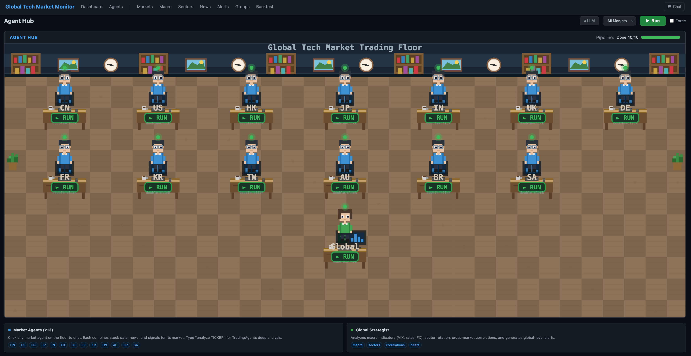

# Worldwide Stock Agentcy

A multi-agent pipeline that tracks global tech stocks across 13 markets, with a web dashboard for signals, news, backtesting, and market analysis.



---

## Markets

CN · US · HK · JP · IN · UK · DE · FR · KR · TW · AU · BR · SA

---

## Features

- **Multi-agent pipeline** — 40 agents (data, news, signal, global) run in parallel with dependency-aware orchestration
- **Web dashboard** — market overview, stock signals, news feed, sector breakdown, capital flow, macro indicators
- **Backtesting** — test custom strategies across any market with 2-year OHLCV history and delta caching
- **Signal generation** — volume breakout, momentum, and custom code-based signals per market
- **Tracing** — full observability via [TraceRoot](https://traceroot.ai)

---

## Setup

```bash
python -m venv venv
source venv/bin/activate
pip install -r requirements.txt
```

---

## Start the Web Dashboard

```bash
./start_web.sh
```

Opens at **http://localhost:5000**

---

## Run the Pipeline

```bash
# Full pipeline — all 40 agents
./run.sh

# Bypass all caches
./run.sh --force

# Single market
./run.sh --market CN

# Single agent
./run.sh --agent CN_data

# All agents of a type (data / news / signal / global)
./run.sh --type signal
```

Pipeline logs are saved to `data/logs/pipeline_YYYYMMDD.log`.

---

## Project Structure

```
src/
  agents/        # DataAgent, NewsAgent, SignalAgent, GlobalAgent + Orchestrator
  backtest/      # Backtesting engine and data loader
  market_data/   # OHLCV fetching (yfinance, akshare)
  universe/      # Stock universe builders per market
  news/          # News fetching and summarisation
  analysis/      # Signal and trend analysis
  common/        # Config, logging, rate limiting, tracing
config/
  markets.yaml   # Market definitions and agent config
  settings.yaml  # API keys and global settings
web/
  app.py         # Flask routes
  templates/     # Jinja2 templates
data/
  markets/       # Per-market snapshots (universe, OHLCV, market cap, indices)
  backtest/      # Backtest history cache and results
```
